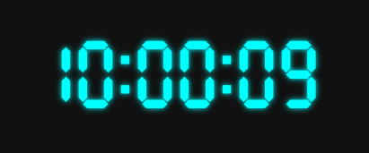

# svg-clock
An svg-only digital clock. Call one lightweight function on page load and allow the animations to do their thang! No silly event-listeners, timeouts, nada



## Dependencies

* None babay!


## Usage
Use it by pointing it to your element:

```javascript
initClock(document.querySelector('#myElement'));
```

## CDN
https://cdn.jsdelivr.net/gh/leimapapa/svg-clock/svgclock.js


## Working Example
[codepen example](https://codepen.io/leimapapa/pen/MWPaRRO)
